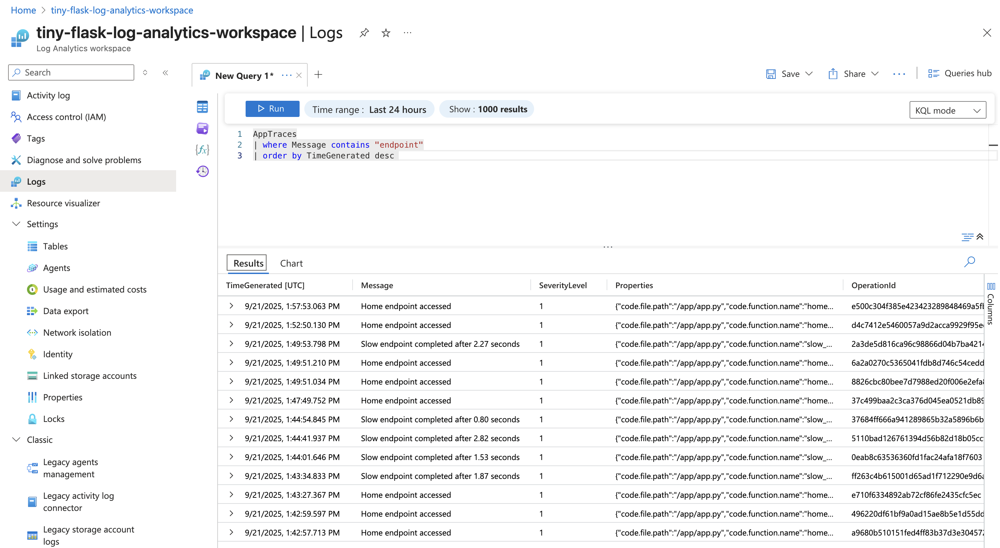
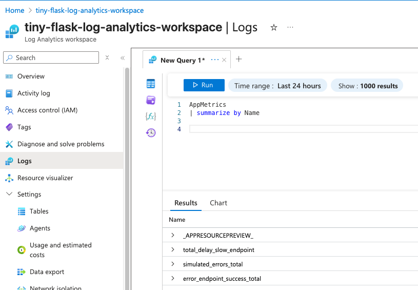
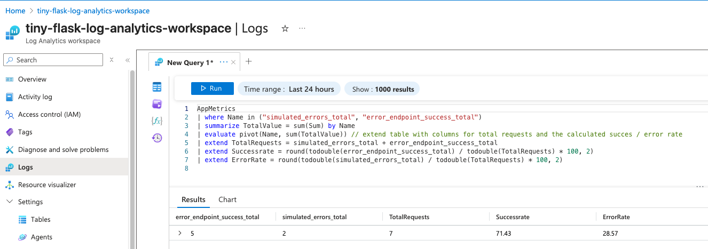
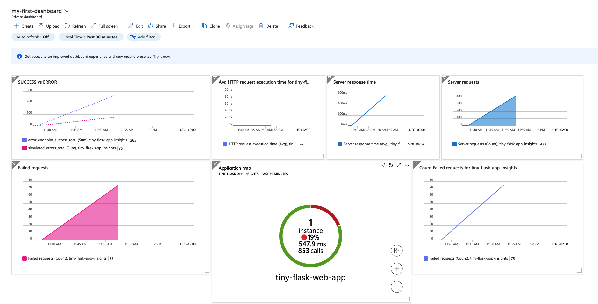

## Project Iteration 2: Monitoring and Diagnostics Implementation

### Syllabus Objectives Covered:
* Configure and implement diagnostics and logging

### Learning Goals:
Implement comprehensive monitoring, logging, and diagnostics for production-ready applications.

### Project Description:
Enhance your web application from Iteration 1 with detailed monitoring capabilities. Implement application logging, performance monitoring, and
automated alerting for production issues.

### Implementation steps: 

1. Enable Application Insights integration
2. Configure application logging levels and destinations
3. Implement custom telemetry and performance counters
4. Set up automated alerts for errors and performance degradation
5. Create dashboards for monitoring application health
6. Practice troubleshooting using logs and metrics

### This iteration is mostly about App Insights and logging.

Due to immense deployment overhead and deployment delay, I have chosen to move away from zip deployments and back to
docker images.
NOTE: When you provision an Azure Application Insights, Azure will automatically create a Managed Log Analytics
Workspace ( unless you create on yourself )

## Application Insights

App Insights is a feature of **Azure Monitor** that helps monitor, diagnose and understand an application's behaviour.
It is like a "black box recorder" for an application that collects telemetry ( requests, errors, performance or custom
events )
Typical telemetry are:

- **Request tracking:** Response times, status codes and failure rates
- **Error tracking:** Exceptions like DB connection errors, Python
- **Dependency tracking:** Outgoing calls (SQL, Key Vault, APIs)
- **Performance metrics:** CPU, Memory usage, request rates.
- **Custom telemetry:** Create custom events to track, like when someone hits some special endpoint.
- **Dashboard and alerts:** Visualize trends with **Azure Monitor** and **Power BI**. Get notified on errors, slow
  response times, or spikes in traffic.

For this iteration I have decided to create a stripped-down stack in order to focus on the learning objective at hand:

*Implement comprehensive monitoring, logging, and diagnostics for applications.*

### 1. Enable Application Insights integration

Since we are using a custom container for our Flask application, we need to include the Application Insights SDK in our
Docker image.
The modern approach to monitoring and reporting telemetry is the `azure-monitor-opentelemetry` package. It handles all
the configuration, automatically tracks
all HTTP requests, response times, and exceptions without having to explicitly add logging statements manually.
I have also chosen to use the `opentelemetry-instrumentation-flask` library, which extends the Open Telemetry middleware
for tracking web requests in Flask applications.

More information on the [Open Telemetry SKD / API](https://opentelemetry.io/)

What is needed:

1) Application Insights resource in Azure
2) Connection string in the applications environment variables, or other way of obtaining it.
3) An application which runs and serves requests ( duh )
4) SDK for telemetry collection and sending.

Now it is possible to see and query for every event that happens within the application. Everything is captured, but you
have
to know what to query for when trying to retrieve useful and valuable information.

### 2. Configure application logging levels and destinations

Telemetry data is great for understanding application behavior at a high level.
However, application logging is about capturing specific events and debug information that you explicitly want to track.

`Configure_azure_monitor()` automatically sets up OpenTelemetry exporters for logs, metrics, and traces.
which means logger.info(), logger.error(), etc. will be sent to Application Insights → Log Analytics.

By default, container logs (stdout/stderr) are also captured by Azure App Service, so with the `StreamHandler` we can see logs in the portal’s Log Stream and in Application Insights.
You can control the verbosity by changing the log level on `logger.setLevel()`
Logging is configured in a separate `logging_config.py` file, and imported as a module. 


#### Logging modes

`DEBUG mode` = log everything (very chatty, useful in dev / debugging )

`INFO mode` = log everything except `DEBUG` (Less noisy, logs `INFO, WARNING, ERROR, CRITICAL`)

#### How to test logging: 
1) Provision the resources with the `up.sh` script
2) Run the `simulate_load.sh` script. It will perform a random number of requests to various endpoints.
3) Enter the Log Analytics Workspace in Azure Portal. Choose any predefined query, or edit your own: 
```KQL
AppTraces
| where Message contains "endpoint"
| order by TimeGenerated desc
 ```
This query will display all logs containing the string "endpoint".



### 3. Implement custom telemetry and performance counters

This part is quite easy, we can use openTelemetry's meter to create gauges and report on them.
In Azure Log Analytics Workspace we can the query for a special kind of telemetry: `Appmetrics`.

#### Short on KQL (Kusto Query Language)
A Microsoft developed, read-only query language for exploring and analyzing datasets, such as the Application Insights Tables. Operations can be piped `|` together to create 
powerful and meaningful queries for analytics work.

Here are a couple of examples of queries on the custom created gauges from this project:

###### Get all custom metrics ( gauges / counters ) to query for
```KQL
AppMetrics 
| sumarize by Name
```


##### Total delay used on slow endpoint
```KQL
AppMetrics
| where Name == "total_delay_slow_endpoint"
| summarize total_delay_s = sum(Sum)
```

##### Output success / error rate with percentage distribution
```KQL
AppMetrics
| where Name in ("simulated_errors_total", "error_endpoint_success_total")
| summarize TotalValue = sum(Sum) by Name
| evaluate pivot(Name, sum(TotalValue)) // extend table with columns for total requests and the calculated succes / error rate
| extend TotalRequests = simulated_errors_total + error_endpoint_success_total
| extend Successrate = round(todouble(error_endpoint_success_total) / todouble(TotalRequests) * 100, 2)
| extend ErrorRate = round(todouble(simulated_errors_total) / todouble(TotalRequests) * 100, 2)
```


Tons of information about the possibilities with KQL can be found in the Microsoft fabric ( of time ) documentation: [Kusto](https://learn.microsoft.com/en-us/kusto/?view=microsoft-fabric)

### 4. Set up automated alerts for errors and performance degradation

Azure alerting is a fundamental monitoring concept that transforms your passive telemetry data into an active notification system.
Azure alerts consists of three components:
- **The alert rule**: which defines the condition for triggering the alert. These rules continuously evaluate metrics or logs against defined thresholds. 


- **The action group**: defines what happens if an alert is raised. It can use email addresses, SMS and webhook's in order to alert the right instances. 
However, action groups can also trigger Azure functions for custom remediation logic, send alerts to slack, create tickets to a service team. It for example automatically scale up your Azure Service plan to handle unexpected loads, or clear caches if memory consumption is rising too fast.


- **The alerts**: which are the actual instances created when the rules trigger, containing all the context about what happened and when.

Alerts can be created on for example the custom metric values from Application Insights for this project. We can also create alerts from platform metrics from App Service, like CPU usage, response times, or even log events.
Platform metric alerts are perfect for *threshold-based* monitoring, like "CPU above 70%", while log alerts excel at detecting patterns, like "more than 10 errors the last 5 minutes for this endpoint" 

It is important to note that even though one might create Alert rules, they do not actually do anything, unless they are tied to an action group. 
For this demonstration I have chosen to create one **Metric Alert ( threshold-based )** and one **Log Query ( pattern-based / log-based monitoring)**

- Platform Metric Alert: CPU usage > 70% on App Service Plan. Implemented with `azurerm_monitor_metric_alert`
- Log Query Alert: Fire when `/error` endpoint reports more than 10 errors within a 1-minute bucket.  Implemented with `azurerm_monitor_scheduled_query_rules_alert`

#### Action Group 
The action group is created with Terraform `azurerm_monitor_action_group` resource. You can replace the `email_receiver / sms_receiver` with your own email and phone number.

### Note on Application Insights vs Log Analytics Workspace 
#### Application Insights
- Focused on **Application level** telemetry: requests, traces, custom-metrics, exceptions etc. 
- SDK driven ( This example application uses OpenTelemetry exporter to send data here ).
- Can run KQL queries, but only against its own data 

#### Log Analytics Workspace 
- **Centralized data store** for all kinds of telemetry, not just app-level.
- Collects data from many sources, VMs, Containers, networking, App Services and also Application Insights. 
- Runs KQL across all connected resources.

In this project, the **Flask Application** with **OpenTelemetry** &rarr; sends data to **Application Insights** ( via connection string).
The **Application Insights** resource forwards &rarr; all data to the **Log Analytics Workspace**

### How to test:
After replacing the email / phone number with your own and running the `up.sh` script, everything is ready for testing. 
Use the script to start sending requests for endpoints of your choosing. 
```bash
simulate_load.sh
```
The default setup will utilize `hey` to hammer the `/error` and `/memory` endpoint on a regular interval.
You should receive an email and sms alert about high spikes in CUP from the App Service Plan, and an alert about 
high number of errors from the Log Analytics Workspace.


### 5. Create dashboards for monitoring application health
Creating custom dashboards is usually done through the Azure Portal. That way, one may utilize the vizual editor and drag-and-drop features therein. 
After creation, a dashboard may be exported / downloaded as a `JSON` file, and later deployed through ARM templates, Terraform or other IaC tools. With Terraform, we can use this resource: 
```terraform
resource "azurerm_dashboard" "tiny_flask_dashboard" {
  name                = "tiny-flask-health-dashboard"
  resource_group_name = azurerm_resource_group.tiny-flask-rg.name
  location            = azurerm_resource_group.tiny-flask-rg.location

  tags = {
    source = "terraform"
  }
  dashboard_properties = jsondecode({
    // JSON formated dashboard... 
  })
}
```
Here is a screenshot of one I created for this project: 



### Key Learning Questions:
#### How do you differentiate between different types of logs in App Service?
This project touches on three different types of logs which App Service generates. 
-**Platform logs** : These are logs we can observe in the Log Stream in Azure Portal. Logs like "Site startup probe succeeded" and "Container is running" are examples of Platform Logs.
-**Application logs** : In our Python code we used **stdout** and **stderr** for logging specific events, such as `logger.info("Home endpoint accessed")`
-**AppTraces**: The final category appeared in `Application Insights` and were created through our custom gauges and OpenTelemetry.

#### What's the relationship between Application Insights and App Service logging?
These two systems operate in parallel. The `App Service` logs provides the foundational platform observability. Once we added the `Application Insights` connection string, and 
added `OpenTelemetry` to the Application, we effectively created a bridge where the application itself can push rich telemetry to `Application Insights`. 

#### How can you correlate logs across multiple application components?
Even though this project example is a single application, we can connect failed requests to specific exceptions. Since `OpenTelemetry` adds operation ID's and 
parent ID's to related log entries we would query something like this:
```
AppRequests | where Success == false | join AppExceptions on OperationId
```
These three concepts work together to create comprehensive observability: 
App Service provides the platform foundation, Application Insights adds application-specific intelligence, and correlation IDs tie everything together into diagnostic stories.

A more "real-life" scenario would be to have multiple resources or applications, sharing the same `Application Insights` instance. 
We could then do powerful log queries and analytics on shared `Correlation Id's` across multiple services. 