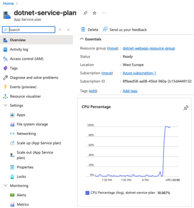
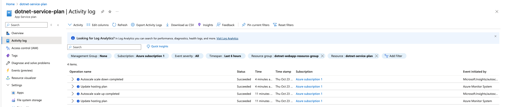

# Project Iteration 4: Scaling and Performance Optimization

### Syllabus Objectives Covered:

* Implement autoscaling

### Learning goals:

Configure automatic scaling policies that respond to application demand while optimizing costs and performance.

### Project Description:

Configure a web application to automatically scale based on various metrics. Simulate traffic patterns and observe how
different scaling
configurations respond to load changes.

### Implementation steps:

1. Configure CPU-based auto-scaling rules
2. Implement HTTP queue length scaling for better responsiveness
3. Set up schedule-based scaling for predictable traffic patterns
4. Test scaling behavior under simulated load
5. Optimize scaling parameters for cost and performance balance
6. Monitor scaling events and their impact on application performance

## 🏛️ The Three Pillars of Auto-Scaling 🏛️

Azure App Service operations on three fundamental mechanisms.

### 1. Metric-Based Scaling (Reactive)

This is the most common scaling pattern, where the application scales in response to resource utilization or queue
depths. These are based on predefined
triggers on metrics and scale out when certain thresholds are crossed.

#### CPU Percentage Scaling:

- Monitor average CPU usage across all instances.
- Example: "Scale out with one instance when average CPU > 70% for 5 minutes".
- Best for: Compute-intensive applications (image processing, data analysis, calculations)
- Weakness: Reactive, rather than proactive. End-user might experience slow-down before scaling kicks in.
- Exam Scenario: "Your application performs heavy computational work on user requests..."

#### Memory Percentage Scaling:

- Monitors average memory usage across all instances.
- Example: "Scale out when memory > 80%".
- Best for: Applications with large in-memory caches or data structures.
- Weakness: Memory often does not decrease quicly when load drops, which means instances might run longer than needed.
- Exam Scenario: "Your application caches large datasets in memory..."

#### HTTP Queue Length Scaling:

- Monitors the number of HTTP requests waiting to be processed.
- Example: "Scale out when queue length > 100 requests".
- Best for: Web APIs and request-driven applications where responsiveness matters.
- Strength: More proactive than CPU-scaling, as it happens before the users experience slow-down.
- Exam Scenario: "Your REST API must maintain low latency under varying load..."

### 2. Schedule-Based Scaling (Predictive)

This pattern scales the application based on known traffic patterns and trends rather than waiting for metrics to
trigger scaling.

#### Time-Based Rules:

- Example: "Scale to 10 instances every weekday between 8AM and 6PM"
- Best for: Business applications with predictive usage patterns.
- Strength: Proactive - capacity is ready before demand.
- Cost benefit: Can scale down aggressively during known low-traffic periods
- Exam scenario: "Your application serves business users primarily between 9-5 weekday hours"

#### Date-based Rules:

- Example: "Scale to 50 instances on Black Friday, scale to 30 instances during December"
- Best for: Seasonal business or event-driven traffic.
- Real-world example: Tax preparation scaling in March - April.
- Exam scenario: "Your e-commerce site experiences predictable seasonal traffic spikes."

### 3. Manual Scaling (Administrative)

While not being "auto-scaling", it is still an important baseline capacity.

#### Instance Count:

- Set minimum and maximum instances for auto-scaling rules.
- Example: "Always run at least 2 instances for high availability, never exceed 20 instances to control costs"
- The auto-scaler operates within these boundaries.

#### Scale Up (Vertical Scaling):

- Changing to a more powerful App Service Plan SKU (e.g. S1 or S2)
- Provides more CPU, memory and storage per instance.
- Requires brief downtime during tier change ❗
- Exam distinction: **"Scale up"** = bigger instance, **"Scale out"** = more instances.

**Real-World Strategy:**
Most production applications use conservative scale-out (trigger early, before users notice slowness) combined with
cautious scale-in (wait longer before removing capacity).  
The cost of occasional over-provisioning is usually far less
than the cost of poor user experience or lost transactions.

### How Auto-Scaling Works: Evaluation loop

Azure evaluates and applies scale rules through a **Decision Process**:

1) **Collect Metrics:** From all instances every 1-2 minutes and aggregates them into averages, sums, minimums, maximums
   depending on rule configuration.
2) **Rule Evaluation:** Every 1-5 minutes, evaluate collected metrics against defined rules. E.g. "average CPU over the
   last 5 minutes > 70%".
3) **Cooldown Period:** After a scale operation, Azure waits for a cooldown period. This is to avoid "flapping", where
   scale-in and scale-out happens too rapidly, wasting money and potentially
   causing instability.
4) **Scale Operation Execution:** When a rule triggers, and cooldown has passed, Azure provisions new instances or
   removes instances.
   New instances takes about 1-3 minutes before they are up and healthy.
5) **Continuous Monitoring:** The monitoring cycle repeats continuously.

When we specify a new `Metric Trigger` in Azure, we can specify a time grain and a time window on which to evaluate:

```hlc
time_grain  = "PT1M" 
time_window = "PT5M"
```

The `time_grain`, defines sampling frequency / bucket size. It tells Azure Monitor to do a data pont sample every
minute. For our CPU example,
Azure measures the average CPU during that 1-minute bucket.

The **Time Window** defines how far back we look in our metrics. This means that Azure looks at the last 5 minutes, and
here with a 1-minute grain, we would get 5 data points on which to
evaluate whether to scale out or not. For example:

```bash
Minute 1: 60%  --
Minute 2: 60%   |
Minute 3: 80%   |- These 5 samples are evaluated together
Minute 4: 100%  |
Minute 5: 100% --

Average = (60 + 60 + 80 + 100 + 100) / 5 = 80%
```

### ⚠️ Important App Service Plan Tiers and Auto-Scaling ⚠️

| Tier       | SKUs                         | Auto-scaling | Manual scaling | Max instances | Key scaling features                                                                                         | Typical Use Case                                   | AZ-204 Exam notes                                          |
|------------|------------------------------|--------------|----------------|---------------|--------------------------------------------------------------------------------------------------------------|----------------------------------------------------|------------------------------------------------------------|
| Free       | F1                           | ❌ No         | ❌ No           | 1 (fixed)     | No scaling capability, Shared compute, 60 CPU minutes/day limit                                              | Development/testing only                           | ❌ Never correct for production scenarios                   |
| Shared     | D1                           | ❌ No         | ❌ No           | 1 (fixed)     | No scaling capability, Shared compute, 240 CPU minutes/day limit                                             | Development/testing only                           | ❌ Never correct for production scenarios                   |
| Basic      | B1, B2, B3                   | ❌ No         | ✅ Yes          | 3             | Manual scale only, Must explicitly change instance count, No deployment slots                                | Small production apps with predictable stable load | ⚠️ Exam trap: Cannot use for "automatic scaling" questions |
| Standard   | S1, S2, S3                   | ✅ Yes        | ✅ Yes          | 10            | Full auto-scaling support, All metrics available, Deployment slots (5), Schedule-based scaling               | Most production applications with variable traffic | ✅ **Minimum tier** for auto-scaling questions              |
| Premium v2 | P1v2, P2v2, P3v2             | ✅ Yes        | ✅ Yes          | 30            | Advanced auto-scaling (traffic based), Better performance, More deployment slots (20), VNet integration      | High-performance production apps                   | ✅ Appears in high-availability scenarios                   |
| Premium v3 | P0v3, P1v3, P2v3, P3v3       | ✅ Yes        | ✅ Yes          | 30-100        | Advanced auto-scaling (traffic based), Best performance/cost ratio, Up to 100 instances, VNet integration    | Modern high-performance workloads                  | ✅ Latest generation, best performance                      |
| Isolated   | I1, I2, I3, I1v2, I2v2, I3v2 | ✅ Yes        | ✅ Yes          | 100           | Complete network isolation, Dedicated App Service Environment, Highest scale limits, Private VNet deployment | Regulated industries, compliance requirements      | ✅ Correct answer for "network isolation" questions         |

### 💎 Relevant Azure CLI commands for Scaling 💎

```bash
# View current auto-scale settings
az monitor autoscale list \
  --resource-group tiny-flask-resource-group

# Create an auto-scale profile
az monitor autoscale create \
  --resource-group tiny-flask-resource-group \
  --resource tiny-flask-service-plan \
  --resource-type Microsoft.Web/serverFarms \
  --name my-autoscale-setting \
  --min-count 1 \
  --max-count 10 \
  --count 2 

# Add scale-out rule ( CPU based )
az monitor autoscale rule create \
  --resource-group tiny-flask-resource-group \
  --autoscale-name scale-out-autoscale-setting \
  --condition "Percentage CPU > 70 avg 5m" \
  --scale out 1
  
# Add scale-in rule 
az monitor autoscale rule create \
  --resource-group tiny-flask-resource-group \
  --autoscale-name scale-in-autoscale-setting \
  --condition "Percentage CPU < 30 avg 5m" \
  --scale in 1
```

## ⚠️ Challenge: Metric-Based Autoscaling with Containerized Applications ⚠️

### The Issue

When implementing CPU-based and HTTP Queue Length autoscaling rules for this project,I discovered a significant
limitation.
Traditional platform-level metrics are not reliably available when using custom Docker containers on the Linux App
Service.

#### What I observed:

- Web App level metrics (CPU Time, Inbound / Outbound data, Requests, etc.) are visible and reflect container activity
  correctly.
- App Service Plan level metrics ( CPU Percentage, HTTP Queue Length etc.) does not reflect container activity at all.
  Only the Service Plans own usage, which usually only show any activity on startup and some scheduled "liveness" check
  which runs from time to time.
- Since autoscaling rules require App Service Plan metrics, which aren't being populated, we will never able to trigger
  our scale-out rules.

#### Why this happens:

On Linux App Service Plans, Azure isolates applications inside containers, even for built-in runtimes. This creates an
additional abstraction layer, that could prevent metrics from being properly aggregated.

For custom containers (any Docker image you deploy), Azure might not inject its telemetry agent properly, meaning it has
no visibility into the actual CPU or memory usage inside our containers.
So from Azure’s perspective, the container is a “black box.”

As far as I could deduce, this is a known issue when running custom containers on a Linux Service Plan.
The work-around would be to create custom telemetry, and create actions that could trigger scaling out. But this is much
more cumbersome. 🥒

---

### ❗As a consequence of these limitations, all the Scaling And Performance Optimization demonstrations will be performed on a Windows App Service Plan❗

---

## 1 - 4. Configure CPU + HTTP queue-length + Schedule-based auto-scaling rules + Test Scaling Behaviour.

### CPU-based auto-scaling

In order to solve these challenge, we should use the `azurerm_monitor_autoscale_setting` resource. This resource
provides us with everything we need to perform Auto-Scaling.
You can observe the CPU-based rules in the provided `terraform.tf` file.
For simulating load, and trigger the CPU-based and HTTP queue length auto-scaling rules, I have created a script you can
run against your application after provisioning the required resources.

```bash
./simulate_load.sh
```

It will continuously simulate a lot of traffic against the cpu-intensive endpoint for 6 minutes. It is more than enough
to burn our CPU for the required time window.

After running the script, enter azure portal, and observe how the CPU metric spikes:


Give the script time to finish, and you will also be able to observe through the **Scale out(App Service plan)** under
Settings, that the "Active instance count" has increased to 3.

You will also be able to observe that both the scale-out and scale-in operations has been triggered in the service plans
**Activity log**:


### HTTP Queue Length Scaling

HTTP Queue Length is often **preferred over CPU** for web applications because:

- More directly measures user-facing performance (requests waiting = users waiting).
- Triggers scaling before CPU saturation, which would causes slowdowns.
- Better for I/O-bound applications that don't max out CPU.
- Better for Web APIs with strict latency requirements.

In order to set up a rule for HTTP Queue, simply replace ( or expand ) the rules in the Azure Autoscale Monitor
resource:

```hcl
rule {
  metric_trigger {
    metric_name        = "HttpQueueLength"
    metric_resource_id = azurerm_service_plan.dotnet_plan.id
    time_grain         = "PT1M"
    statistic          = "Average"
    time_window        = "PT5M"
    time_aggregation   = "Average"
    operator           = "GreaterThan"
    threshold          = 25  # Scale when 25+ requests are queued
  }

  scale_action {
    direction = "Increase"
    type      = "ChangeCount"
    value     = 1
    cooldown  = "PT3M"
  }
}
```

### Schedule-Based scaling (predictive)

Unlike metric-based scaling, schedule-based scaling acts **proactively** based on time rather than **reactively** based
on load.

**Use Cases:**

- Business applications with predictable 9-5 weekday traffic.
- E-commerce sites with known traffic patterns (lunch hours, after-work shopping, holiday sales, etc.).
- Applications that need capacity ready BEFORE users arrive.

Here is an example on how you can configure schedule based scale-outs:

```hcl
profile {
  name = "Business hours scale-out"

  capacity {
    default = 3
    minimum = 3
    maximum = 5
  }

  recurrence {
    timezone = "W. Europe Standard Time"
    days = ["Monday", "Tuesday", "Wednesday", "Thursday", "Friday"]
    hours = [8]  # 8:00
    minutes = [0]
  }
}

profile {
  name = "After hours scale-in"

  capacity {
    default = 1
    minimum = 1
    maximum = 1
  }

  recurrence {
    timezone = "W. Europe Standard Time"
    days = ["Monday", "Tuesday", "Wednesday", "Thursday", "Friday"]
    hours = [18] # 18:00
    minutes = [0]
  }
}
```


### 5. Optimize scaling parameters for cost and performance balance

This is really more about what we can observe and which trade-offs we should be aware of.

- **Lower thresholds** (e.g. 50% vs 70%) &rarr; faster scaling, but higher cost
- **Shorter cooldowns** (e.g. PT3M vs PT5M) &rarr; more responsive, but risks flapping
- **Higher max instances** (e.g. 10 vs 3) &rarr; better peak capacity, but higher cost ceiling

The parameters chosen for this demonstration balance testability and ease of implementation. In production, you'd choose scale-out strategies based on:
- **Business requirements** : how much latency can users tolerate?
- **Budget constraints** : what is the acceptable monthly expenditure?
- **Traffic patterns** : is the traffic random or predictable?

**Example cost consideration:** Running 3 S1 instances 24/7 costs ~$300/month vs 1 instance at ~$100/month. If you only
need 3 instances during 8-hour business days, schedule-based scaling saves roughly ~$133/month.

### 6. Monitor scaling events:

If you followed this guide, you have most likely been monitoring both the metrics for the Service Plan and the scaling
events in the activity log.

### Key learning Questions:

#### When should you use CPU-based versus HTTP queue length scaling?

**Use CPU-based when:**

- Application is compute-intensive (image processing, calculations, data-analysis).
- CPU saturation is known as the bottleneck.
- You have predictable CPU patterns.

**Use HTTP Length when:**

- Application is I/O bound or network bound.
- User-facing latency is the primary concern ( user-friendliness ).
- You need more proactive scaling before users notice slowness.
- ⭐ Generally preferred for most web applications! ⭐

#### How do scaling cooldown periods affect your application's responsiveness to traffic changes?

Cooldown periods prevents "flapping" (rapid scaling up and down) which:

- Saves costs by preventing unnecessary scale-out operations.
- Provides stability by letting new instances warm up before accepting traffic.
- Can delay responsiveness due to sudden genuine load increases...

**Best practice 👃🏻:** Use shorter cooldowns for scale-out (PT3M) to respond quickly to load, and longer cooldowns for
scale-in (PT5M-PT10M) to avoid removing capacity to soon.

#### What's the relationship between scaling rules and App Service Plan capacity?

Scaling rules operates within the boundaries defined in the App Service Plan:

- **Minimum instances:** Always maintained for availability (cost floor).
- **Maximum instances:** Never exceeded to control cost (cost ceiling).
- **SKU capabilities:** Basic tier doesn't support autoscaling at all, Standard supports up to 10 instances, Premium
  supports 30-100.

❗N.B. The autoscale settings can never override the plan limitations. If the plan supports at most 10 instances, the
scaling rule can never create an 11th instance. ❗