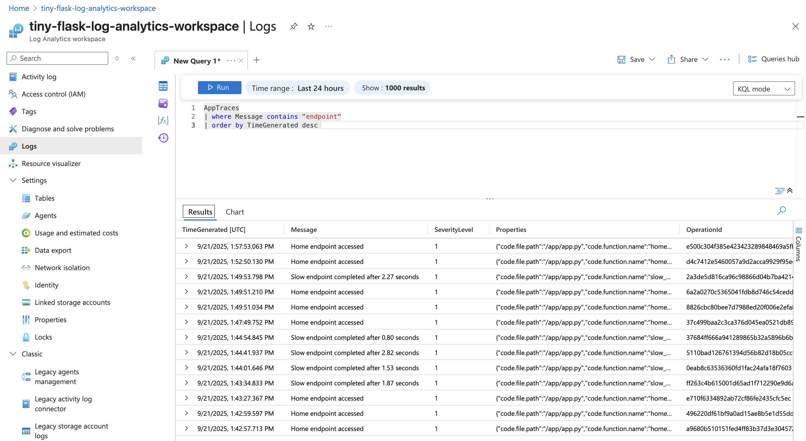

## Iteration 2

1. Enable Application Insights integration
2. Configure application logging levels and destinations
3. Implement custom telemetry and performance counters
4. Set up automated alerts for errors and performance degradation
5. Create dashboards for monitoring application health
6. Practice troubleshooting using logs and metrics

### This iteration is mostly about App Insights and logging.

## Application Insights

App Insights is a feature of **Azure Monitor** that helps monitor, diagnose and understand an application's behaviour.
It is like a "black box recorder" for an application that collects telemetry ( requests, errors, performance or custom
events )
Typical telemetry are:

- **Request tracking:** Response times, status codes and failure rates
- **Error tracking:** Exceptions like DB connection errors, Python
- **Dependency tracking:** Outgoing calls (SQL, Key Vault, APIs)
- **Performance metrics:** CPU, Memory usage, request rates.
- **Custom telemetry:** Create custom events to track, like when someone hits some special endpoint.
- **Dashboard and alerts:** Visualize trends with **Azure Monitor** and **Power BI**. Get notified on errors, slow
  response times, or spikes in traffic.

For this iteration I have decided to create a stripped-down stack in order to focus on the learning objective at hand:

*Implement comprehensive monitoring, logging, and diagnostics for applications.*

### Iteration 2

Due to immense deployment overhead and deployment delay, I have chosen to move away from zip deployments and back to
docker images.
NOTE: When you provision an Azure Application Insights, Azure will automatically create a Managed Log Analytics
Workspace ( unless you create on yourself )

### 1. Enable Application Insights integration

Since we are using a custom container for our Flask application, we need to include the Application Insights SDK in our
Docker image.
The modern approach to monitoring and reporting telemetry is the `azure-monitor-opentelemetry` package. It handles all
the configuration, automatically tracks
all HTTP requests, response times, and exceptions without having to explicitly add logging statements manually.
I have also chosen to use the `opentelemetry-instrumentation-flask` library, which extends the Open Telemetry middleware
for tracking web requests in Flask applications.

More information on the [Open Telemetry SKD / API](https://opentelemetry.io/)

What is needed:

1) Application Insights resource in Azure
2) Connection string in the applications environment variables, or other way of obtaining it.
3) An application which runs and serves requests ( duh )
4) SDK for telemetry collection and sending.

Now it is possible to see and query for every event that happens within the application. Everything is captured, but you
have
to know what to query for when trying to retrieve useful and valuable information.

### TODO add more info about what we can observe in Application Insights and in the log analytics workspace.

### 2. Configure application logging levels and destinations

Telemetry data is great for understanding application behavior at a high level.
However, application logging is about capturing specific events and debug information that you explicitly want to track.

`Configure_azure_monitor()` automatically sets up OpenTelemetry exporters for logs, metrics, and traces.
which means logger.info(), logger.error(), etc. will be sent to Application Insights → Log Analytics.

By default, container logs (stdout/stderr) are also captured by Azure App Service, so with the `StreamHandler` we can see logs in the portal’s Log Stream and in Application Insights.
You can control the verbosity by changing the log level on `logger.setLevel()`
Logging is configured in a separate `logging_config.py` file, and imported as a module. 


#### Logging modes

`DEBUG mode` = log everything (very chatty, useful in dev / debugging )

`INFO mode` = log everything except `DEBUG` (Less noisy, logs `INFO, WARNING, ERROR, CRITICAL`)

### How to test logging: 
1) Provision the resources with the `up.sh` script
2) Run the `simulate_load.sh` script. It will perform a random number of requests to various endpoints.
3) Enter the Log Analytics Workspace in Azure Portal. Choose any predefined query, or edit your own: 
```KQL
AppTraces
| where Message contains "endpoint"
| order by TimeGenerated desc
 ```
This query will display all logs containing the string "endpoint".



### 3. Implement custom telemetry and performance counters

This part is quite easy, we can use openTelemetry's meter to create gauges and report on them.
In Azure Log Analytics Workspace we can the query for a special kind of telemetry: `Appmetrics`.

#### Short on KQL (Kusto Query Language)
A Microsoft developed, read-only query language for exploring and analyzing datasets, such as the Application Insights Tables. Operations can be piped `|` together to create 
powerful and meaningful queries for analytics work.

Here are a couple of examples of queries on the custom created gauges from this project:

###### Get all custom metrics ( gauges / counters ) to query for
```KQL
AppMetrics 
| sumarize by Name
```


##### Total delay used on slow endpoint
```KQL
AppMetrics
| where Name == "total_delay_slow_endpoint"
| summarize total_delay_s = sum(Sum)
```

##### Output success / error rate with percentage distribution
```KQL
AppMetrics
| where Name in ("simulated_errors_total", "error_endpoint_success_total")
| summarize TotalValue = sum(Sum) by Name
| evaluate pivot(Name, sum(TotalValue)) // extend table with columns for total requests and the calculated succes / error rate
| extend TotalRequests = simulated_errors_total + error_endpoint_success_total
| extend Successrate = round(todouble(error_endpoint_success_total) / todouble(TotalRequests) * 100, 2)
| extend ErrorRate = round(todouble(simulated_errors_total) / todouble(TotalRequests) * 100, 2)
```


Tons of information about the possibilities with KQL can be found in the Microsoft fabric ( of time ) documentation: [Kusto](https://learn.microsoft.com/en-us/kusto/?view=microsoft-fabric)