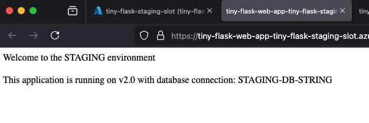
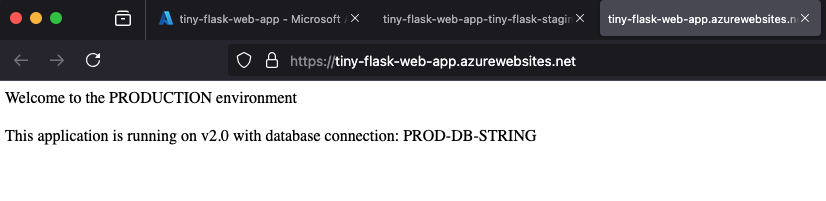
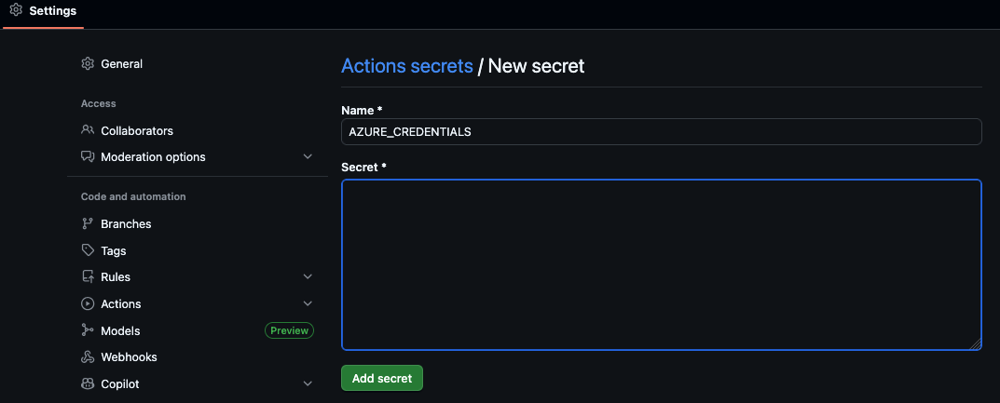
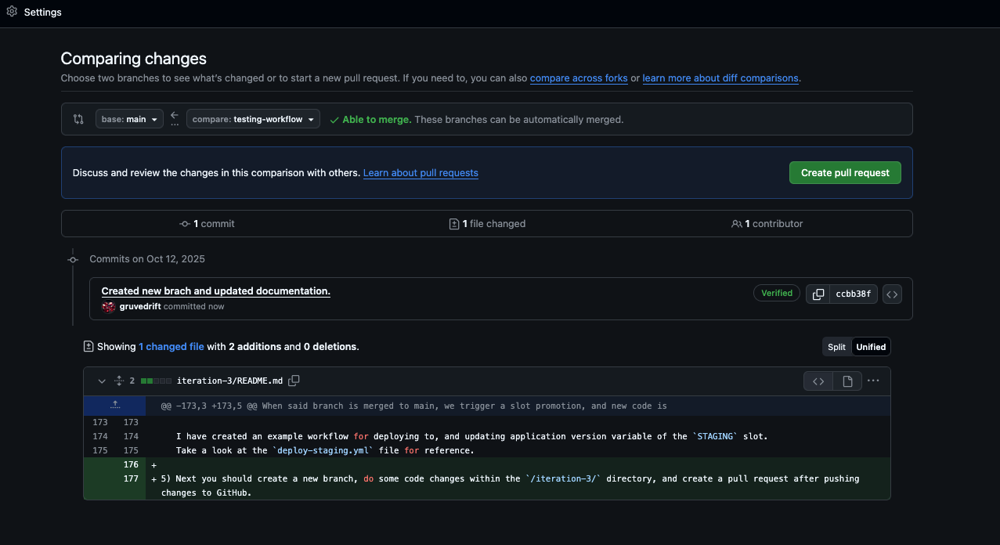
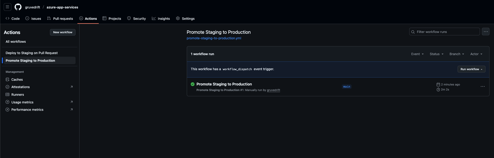

## Project Iteration 3: Advanced Deployment Strategies

#### Syllabus Objectives Covered:

* Deploy code and containerized solutions
* Configure deployment slots

**Learning Goals:** Master sophisticated deployment patterns that enable safe, continuous delivery to production
environments.

**Project Description:** Implement a complete CI/CD pipeline using deployment slots. Create staging and production
environments that allow safe testing of changes
before they affect real users.

### Implementation Steps:

1. Create staging and production deployment slots
2. Configure slot-specific settings versus shared settings
3. Implement automated deployment from Git repository to staging
4. Create a manual promotion process from staging to production
5. Test slot swap operations and understand their implications
6. Implement rollback procedures for failed deployments

### 1 + 2 + 4 + 5. Staging and production deployment slots + Slot-specific settings + Manual promotion + Test swap operation.

Azure App Service deployment slots are live environments within the same App Service instance, which means we don't pay
for additional
deployment slots. Each slot has its own hostname and configuration. This allows us to:

- Deploy new versions safely ( while having the old versions running simultaneously )
- Test the new version in a staging environment before going live.
- Swap slots to promote a version to production with zero downtime.
- Easy rollback if a deployment fails.

Slots can be created through the Azure Portal, with the Azure CLI, or with Terraform. For this project iteration, we
will mostly look at the use of Terraform for
creating the necessary resources, and use scripting with Azure CLI for promoting and SWÆP slots.

❗ Deployment Slots are only available for  **Standard** or **Premium** Service plans. ❗

#### Key characteristics:

| **Feature**                  | **Description**                                                 |
|------------------------------|-----------------------------------------------------------------|
| **Slot-specific settings**   | Some settings ( like connection strings) can be unique per.slot |
| **Shared resources**         | Slots share the same App Service plan ( CPU, memory)            |
| **Swap capability**          | You can swap staging and production seamlessly                  |
| **Zero downtime deployment** | Users experience minimal interruption during slot swaps         |

#### When to use Deployment slots?

- When you need **staging environments** for testing.
- When you want **gradual rollouts** for versions.
- When your application requires **zero downtime** deployments.

For this sub-iteration I have chosen the following approach. Create two slots, one for `staging` and one
for `production`.
With App Service Slots, the main web app we create **is** the production slot. This means we only need to configure one
additional slot for this example.
It is important to note that all app settings are swapped when slots are swapped.

```terraform
app_settings = {
  # Slot specific environment variables
  APPLICATION_VERSION = "v1.0"
  ENVIRONMENT         = "STAGING"
}
```

That means that if we swap the `STAGING` slot with the `PRODUCTION` slot, production would suddenly have `ENVIRONMENT="
STAGING".

For this example I have chosen to use "sticky" setting to mark the `ENVIRONMENT`  and `DATABASE_CONNECTION` variables
as "locked to the slot".
Those two variables will be `SLOT SPECIFIC` and will never change, even though we swap slots. This is typically critical
configuration, such
as, database connection strings, authentication details or other environment specific parameters.

#### How this works step by step:

1) Create infrastructure with an extra deployment slot for **staging**.
2) Build application and push to registry. This is the v1.0 version which will run on both slots.
3) Enter the Azure Portal and check out the two deployments and see that the slot specific variables `ENVIRONMENT`
   and `DATABASE_CONNECTION` is correct.
4) Run the `delploy_v2_staging.sh` to create second application, now with a v2.0 tag and deploy it to registry. The
   environment variable should be updated now:
   
5) Run the `swap_slots.sh` script for swapping the slots. You should now be able to observe the production slot,
   running `v2.0`:
   

What we can observe is that the environment variables marked as `sticky`, are slot specific, while the version is
mutable
and can be changed with `Azure CLI`. This is the key behavior that makes deployment slots safe and powerful.

### Relevant Azure CLI commands for SLOTS

```bash
# Create staging slot
az webapp deployment slot create \
    --name <your-webapp-name> \
    --resource-group <your-rg> \
    --slot <slot-name>

# Update container image for slot
az webapp config container set \
    --name  <app-name> \
    --resource-group <resource-group> \
    --slot <slot-name> \
    --container-image-name <new-container-image>

# Update non-sticky environment variables 
az webapp config appsettings set \
    --name <app-name> \
    --resource-group <resource-group> \
    --slot <slot-name> \
    --settings APPLICATION_VERSION=<new-version-tag>
    
# Swap slots
az webapp deployment slot swap \
    --name <app-name> \
    --resource-group <resource-group> \
    --slot <slot-name> \
    --target <target-slot>
```

### 3. Implement automated deployment from Git repository to staging

For this demonstration I chose to use something called "trunk-based development" with deployment gates patterns.
The main branch represents the source of truth, and we can create branches which trigger new deployments to our staging
environment.
When said branch is merged to main, we trigger a slot promotion, and new code is now running in production.

1) Create new branch
2) Push code to GitHub and create a Pull Request
3) Triggers in GitHub listens to pull requests and kicks of building and pushing image to ACR + updating `STAGING` slot
   to pull image with new tag.
4) Now changes can be observed in the staging slot.
5) Merge to main does not automatically promote staging -> production, but has a manual trigger for this.

### How to create automatic deployment pipeline with GitHub.

1) Run the provided script in order to provision supporting infrastructure.
    ```bash
    up.sh
     ```
2) In order for our GitHub action to be able to preform operations on Azure, we need a `Service Principal` with the
   correct roles and scope. Run the following command with adjusted parameters:
    ```bash
    az ad sp create-for-rbac \
      --name "github-action-tiny-flask" \
      --role Contributor \ 
      --scopes /subscriptions/8f9aed58-aa08-45bd-960a-2c15d4449132/resourceGroups/tiny-flask-resource-group \
      --sdk-auth
    ```
   This command will return a JSON with important authentication values. Store the whole JSON output into
   a `GitHub secret` named `AZURE_CREDENTIALS`
   
3) Next, we need to add three other secrets that we need in order to push new Docker Images to
   our `Azure Container Registry`.
   Run the following command:
    ```bash 
      az acr credential show --name tinyflaskcontainerregistry
    ```
   Store `password` &rarr; into `ACR_PASSWORD` and `username` &rarr; `ACR_USERNAME`.

   The last secret we need is the `ACR_LOGIN_SERVER`, which can be obtained by running:
    ```bash
     az acr show --name tinyflaskcontainerregistry --query loginServer -o tsv
     ```
4) Now that we have the authentication values for `Azure` and our `Docker` safely stored in our GitHub repository we can
   start working on the workflows.

   I have created an example workflow for deploying to, and updating application version variable of the `STAGING` slot.
   Take a look at the `deploy-staging.yml` file for reference.

5) Next you should create a new branch, do some code changes within the `/iteration-3/` directory, and create a pull
   request after pushing changes to GitHub:
   
   This should start our workflow, which you can observe working in the pull request, or in the `Actions` tab in your
   repository.
6) Once the workflow is finished, you should be able to see your changes to `app.py` and `APPLICATION_VERSION` variable
   in the `STAGING` slot.
7) The last thing we need to implement is a manually triggered workflow that runs on `MERGE`. I have provided an example
   workflow in the file `promote-staging-to-production.yml`.
8) After we have merged our last workflow to the `Main` branch, we will be able to trigger the new workflow from the
   GitHub UI:
   
   Visit your `PRODUCTION` and `STAGING` slot, and observe that the running versions and `APPLICATION_VERSION` has swapped, while the sticky variables remains slot specific! 🚀 🎉

### 6. Implement rollback procedures for failed deployments
This step is quite easy. I have chosen to implement a manual "emergency" rollback workflow. All it does is simply to 
swap the slot again, so that `PRODUCTION` is demoted to `STAGING`, and `STAGING` is promoted to `PRODUCTION`. 
This puts us in the exact state we had before our deployment. 

Rollback workflow is provided in the file `rollback-production.yml`.